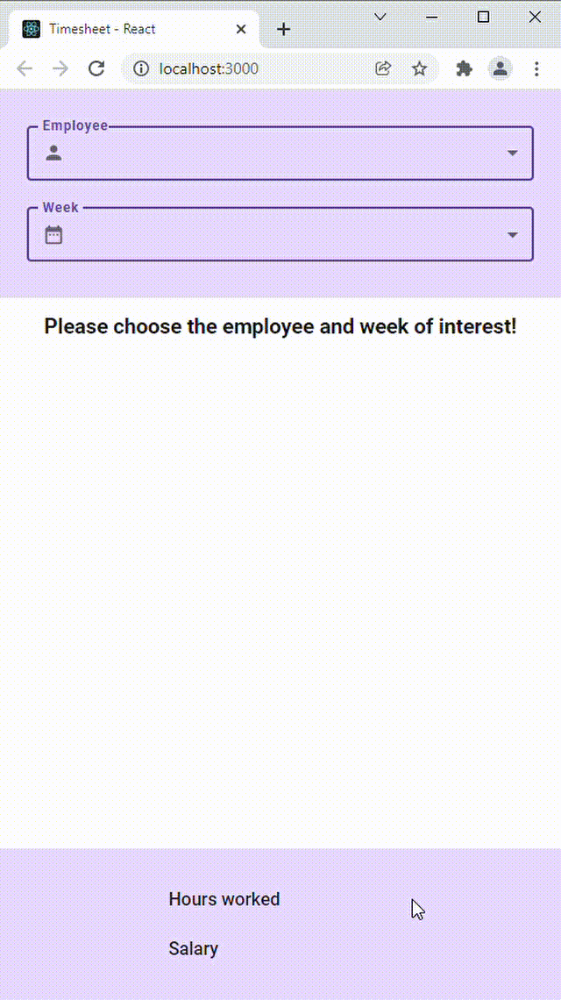

# Timesheet project in React

The task was to implement the UI of simple timesheet entries for different employees and weeks. 
Users can select a timesheet filtered by an employee name and a week, and edit hours worked 
for selected employee and week.

You can view the Figma design [HERE](https://www.figma.com/file/AdaF4Krqiw8Gt7PLhi6TAv/Material-3-Design-Kit-(Community)-(Copy)?node-id=50995%3A3213)

## Project architecture

1. File arrangement:
   - The entry point for all timesheet related components is Timesheet.tsx;
   - Timesheet is separated into 3 sections - header (select), main (hours) and footer (info) - 
   each into its own component;
   - Entry data - calendar and employees - are stored in data file, their respective functions are stored in
   helper files;
   - Elements such as select field, input field, heading, loader are stored in separate components
2. Data logic:
   - For generating calendar weeks I used the [date-fns](https://date-fns.org/docs/Getting-Started) library;
   - For generating employee names I used the [fakerator](https://www.npmjs.com/package/fakerator) library;
   - Hours worked in past weeks and days are generated randomly;
   - For present day and days that are yet to come, hours worked are set to 0;
   - The hour rate for each employee is set as a random integer;
   - Hour rate for weekends is doubled;
   - For each of the employees, the initial timesheet data will be generated by getTimesheetData function in 
   data-helpers file;
   - For storing timesheet data I chose to use Redux;
   - For storing local state, such as select field elements, I used the useState hook;
3. Loading screen:
   - A loader will be showed for all daily salaries and the weekly salary, if a different employee or week is 
   selected;
   - A loader will be showed for the days salary and weekly salary, if the respective days hours will be changed;
4. Style:
   - I used the [MUI](https://mui.com/) library for styled components;

---

## Available Scripts

In the project directory, you can run:

### `npm start`

Runs the app in the development mode.\
Open [http://localhost:3000](http://localhost:3000) to view it in the browser.

The page will reload if you make edits.\
You will also see any lint errors in the console.

### `npm test`

Launches the test runner in the interactive watch mode.\
See the section about [running tests](https://facebook.github.io/create-react-app/docs/running-tests) for more information.

### `npm run build`

Builds the app for production to the `build` folder.\
It correctly bundles React in production mode and optimizes the build for the best performance.

The build is minified and the filenames include the hashes.\
Your app is ready to be deployed!

See the section about [deployment](https://facebook.github.io/create-react-app/docs/deployment) for more information.

### `npm run eject`

**Note: this is a one-way operation. Once you `eject`, you can’t go back!**

If you aren’t satisfied with the build tool and configuration choices, you can `eject` at any time. This command will remove the single build dependency from your project.

Instead, it will copy all the configuration files and the transitive dependencies (webpack, Babel, ESLint, etc) right into your project so you have full control over them. All of the commands except `eject` will still work, but they will point to the copied scripts so you can tweak them. At this point you’re on your own.

You don’t have to ever use `eject`. The curated feature set is suitable for small and middle deployments, and you shouldn’t feel obligated to use this feature. However we understand that this tool wouldn’t be useful if you couldn’t customize it when you are ready for it.

## Learn More

You can learn more in the [Create React App documentation](https://facebook.github.io/create-react-app/docs/getting-started).

To learn React, check out the [React documentation](https://reactjs.org/).
